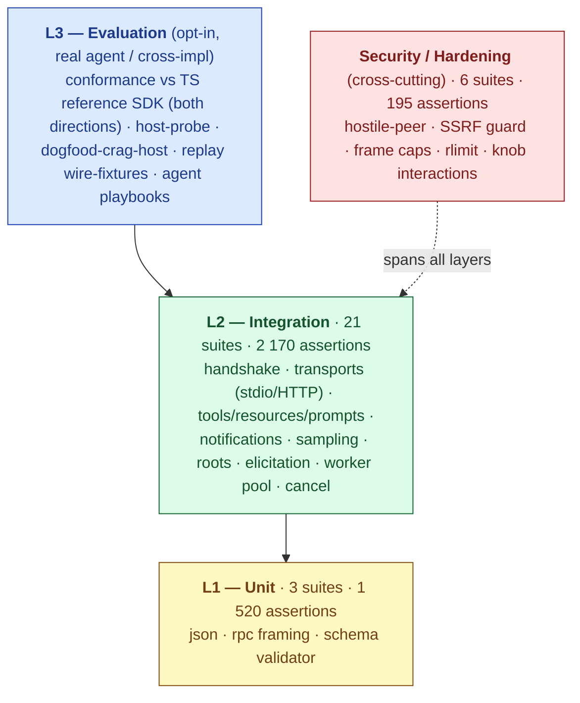
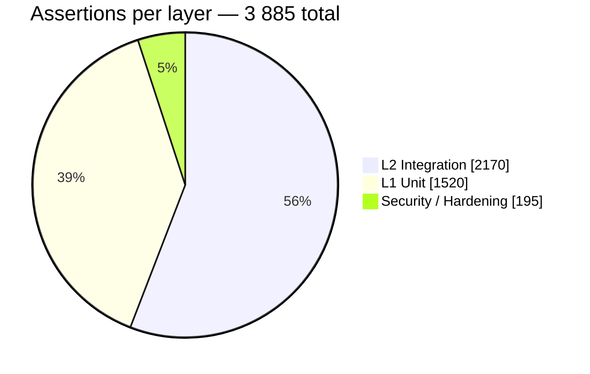
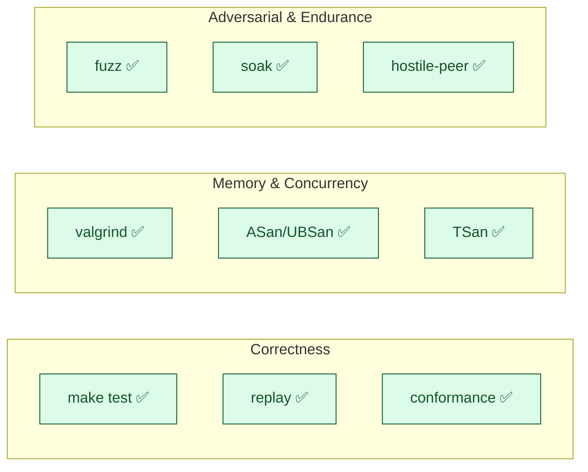
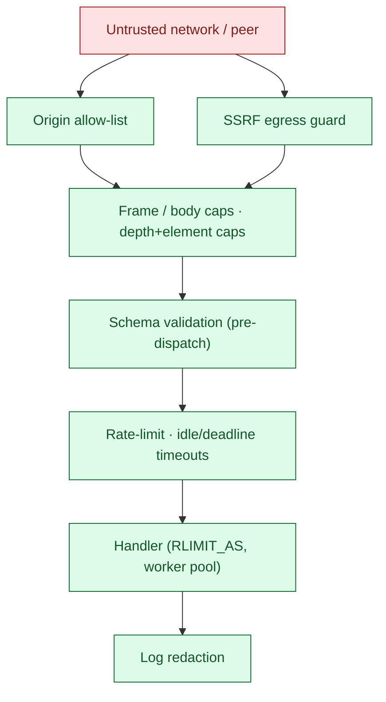

# cMCP — Testing Overview

A visual map of cMCP's test and quality posture, framed against the
three-layer MCP test pyramid (guide Ch.3.1), the load/resilience metrics
(Ch.4), and the MCP security controls (Ch.6).

All numbers below are from the hermetic `make test` run on 2026-06-08:
**3 885 assertions across 30 test binaries**, green under valgrind +
ASan/UBSan + TSan.

---

## 1. The test pyramid (guide Ch.3.1)

cMCP's suites mapped onto the guide's Unit → Integration → Evaluation
hierarchy, with a security/hardening axis that cuts across all layers.

### Assertion distribution (`make test`)

| Layer | Suites | Assertions | Relative |
|---|---:|---:|:--|
| **L1 — Unit** | 3 | 1 520 | `█████████████████████` |
| **L2 — Integration** | 21 | 2 170 | `██████████████████████████████` |
| **Security / Hardening** | 6 | 195 | `███` |
| **L3 — Evaluation** | opt-in | cross-impl* | — |

\* L3 is opt-in (`make conformance` / `make replay`, needs Node+network):
32 assertions cMCP-client-vs-TS-server, 8 checks TS-client-vs-cMCP-server,
plus the stateful `host-probe` and `dogfood-crag-host` consumer probes.

Per-suite breakdown (all 30 binaries)

**L1 — Unit**

| Suite | Assertions |
|---|---:|
| test_rpc | 800 |
| test_schema | 600 |
| test_json | 120 |

**L2 — Integration**

| Suite | Assertions |
|---|---:|
| test_stdio_roundtrip | 807 |
| test_client_helpers | 224 |
| test_resources_prompts | 133 |
| test_http_server | 110 |
| test_tools | 108 |
| test_client_server | 106 |
| test_lifecycle | 99 |
| test_elicitation | 80 |
| test_fs_server | 78 |
| test_logging | 53 |
| test_http_client | 51 |
| test_roots | 50 |
| test_notifications | 47 |
| test_structured_output | 41 |
| test_workers | 38 |
| test_crag_cutoff | 38 |
| test_sampling | 37 |
| test_host_cancel_progress | 30 |
| test_ping | 14 |
| test_pagination | 13 |
| test_http_auth | 13 |

**Security / Hardening**

| Suite | Assertions |
|---|---:|
| test_http_ssrf_guard | 76 |
| test_hostile_peer | 71 |
| test_hardening_cross_knob | 22 |
| test_stdio_frame_cap | 12 |
| test_tee_frame_cap | 10 |
| test_handler_rlimit | 4 |

---

## 2. Quality gates

Every gate below is wired into CI. ✅ = green as of 2026-06-08.

| Gate | Command | What it proves | Status |
|---|---|---|:--:|
| Unit + integration | `make test` | 3 885 assertions / 30 binaries | ✅ |
| Memory safety | `make valgrind` | leak-free, no invalid access | ✅ |
| ASan + UBSan | `make test-asan` | no heap/UB errors | ✅ |
| ThreadSanitizer | `make test-tsan` | no data races | ✅ |
| Fuzzing | `make fuzz-smoke` | 4 libFuzzer harnesses (json/rpc/schema/http) | ✅ |
| Wire regression | `make replay` | captured-transcript replay gate | ✅ |
| Soak (stdio+HTTP) | `make soak` / `soak-http` | no drift over long runs | ✅ |
| Cross-impl conformance | `make conformance` | matches TS reference SDK, both roles | ✅ |
| Spec-drift watch | `make check-spec-drift` | pinned protocol vs upstream | ✅ |

---

## 3. cMCP vs the state of the art (guide Ch.4)

Measured head-to-head against the **official reference SDKs**: the same
cMCP client, the same `tools/call echo` workload over stdio, with the
subprocess server swapped per row (`make bench-compare`, this machine,
2026-06-08, 10 000 iterations after 1 000 warmup). Per the guide's metric
priority (Ch.4.2), latency sits far inside the sub-millisecond band that
disappears inside an LLM inference cycle.

### Throughput — calls/s (higher is better)

| Server | calls/s | vs cMCP | |
|---|---:|---:|:--|
| **cMCP** (C11) | **43 494** | **1.0×** | `████████████████████████████████████████` |
| TypeScript SDK (Node) | 8 035 | 0.18× | `███████` |
| Python SDK (FastMCP) | 974 | 0.02× | `█` |

→ cMCP sustains **5.4× the TypeScript SDK** and **45× the Python SDK**.

### Per-call latency — µs (lower is better)

| Server | p50 | p99 | mean |
|---|---:|---:|---:|
| **cMCP** | **21** | **31** | **22** |
| TypeScript SDK | 95 | 189 | 123 |
| Python SDK | 994 | 1 315 | 1 025 |

### Idle memory footprint — RSS (lower is better)

| Server | idle RSS | vs cMCP | |
|---|---:|---:|:--|
| **cMCP** (328 KB static binary) | **2.2 MB** | **1.0×** | `█` |
| Python SDK (FastMCP) | 60 MB | 27× | `███████████████████████████` |
| TypeScript SDK (Node) | 74 MB | 33× | `█████████████████████████████████` |

### Why the gap

| | cMCP | TypeScript SDK | Python SDK |
|---|---|---|---|
| Language / runtime | C11, native | Node.js | CPython |
| Third-party deps | none* | npm (`sdk`, `zod`) | pip (`mcp`/FastMCP) |
| Server artifact | 328 KB static binary | runtime + `node_modules` | interpreter + venv |
| Conformance | cross-checked vs the TS reference SDK, both wire roles | reference | — |

\* libcurl is linked only by the HTTP *client*; a stdio server carries
zero third-party dependencies.

- **cMCP's pure in-process ceiling** (no subprocess, inline pipe pair) is
  **50 487 calls/s at p50 = 19 µs** — the cross-SDK rows above each pay
  one subprocess hop so all three are measured identically.
- **Resilience knobs (Ch.4.1 spike/idle traffic):** HTTP accept-rate
  token bucket, per-recv idle timeout + cumulative deadline (slowloris),
  stdio/HTTP frame caps (OOM).

> Numbers vary per machine/kernel/build; regenerate with
> `make bench-compare`. Wire-compatibility with the reference SDK is
> separately gated by `make conformance` (both directions).

---

## 4. Security controls (guide Ch.6)

How cMCP's hardening maps onto the guide's MCP threat catalogue. TLS is
deliberately terminator-only (reverse proxy); the deployment threat model
is documented in the architecture notes.

| Guide threat (Ch.6) | cMCP control | Env knob | Test |
|---|---|---|---|
| SSRF via discovery (6.1) | egress guard on resolved peer (rejects metadata/link-local/RFC1918/CGNAT/ULA); DNS-rebinding-safe | `CMCP_HTTP_ALLOW_PRIVATE` | test_http_ssrf_guard |
| DNS rebinding (6.1) | `Origin` allow-list on HTTP server | `CMCP_HTTP_ALLOWED_ORIGINS` | test_http_server |
| Insecure deserialization (6.1/6.3) | schema validation **before** dispatch; depth + element caps | `CMCP_JSON_MAX_DEPTH` / `_ELEMENTS` | test_schema, test_hostile_peer |
| Memory-bomb / OOM (4) | stdio frame cap, HTTP body cap, handler `RLIMIT_AS` | `CMCP_STDIO_MAX_FRAME`, … | test_stdio_frame_cap, test_handler_rlimit |
| Slowloris / spike (4) | accept-rate token bucket, idle + deadline timeouts | `CMCP_HTTP_ACCEPT_RATE`, `_IDLE_TIMEOUT_MS`, `_DEADLINE_MS` | test_hardening_cross_knob |
| Credential leakage (6) | log redactor over credential-shaped keys | `CMCP_LOG_REDACT` | test_http_auth, test_logging |
| Malformed / hostile peer | bounded parsers, fail-closed framing | — | test_hostile_peer |

---

*Regenerate the assertion counts with `make test`; this document is a
point-in-time snapshot (2026-06-08).*
